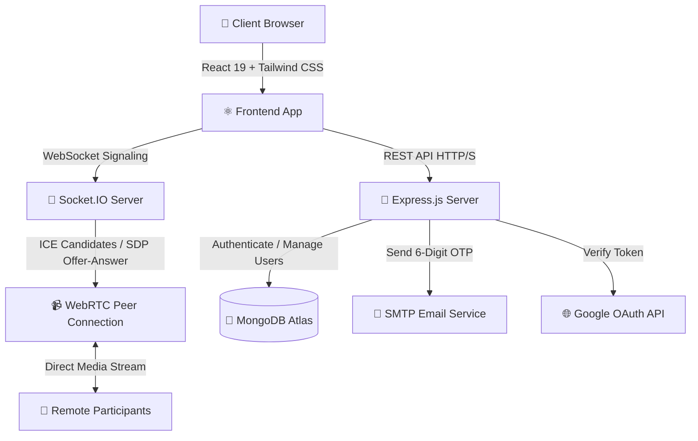

<p align="center">


</p>

<p align="center">


</p>

<p align="center">

<a href="https://live-classes.vercel.app">


</a>

<a href="https://github.com/suvojitmanna/Live-classes">


</a>

</p>

---

## 🏆 Project Badges

<p align="center">


</p>

---

# 📖 Overview

## 🌟 What is Live Classes?

**Live Classes\*//is a production-ready **Full-Stack Real-Time Video Conferencing Platform\*//built using the **MERN Stack**, **Native WebRTC**, and **Socket.IO**.

It delivers a Google Meet-style meeting experience featuring ultra-low latency peer-to-peer video streaming, high-definition screen sharing, live in-meeting chat, pre-join lobby with camera/mic check, Google OAuth, and secure 6-digit email OTP verification.

Suitable for:

- 🎓 Online Classes & Lectures
- 💼 Team Standups & Business Meetings
- 👨‍🏫 Virtual Tutoring & Mentorship
- 🎤 Webinars & Presentations
- 💻 Technical Coding Interviews

---

# ✨ Core Features

### 🎥 Native WebRTC Video & Audio

- 📹 Ultra-low latency peer-to-peer HD video and crystal-clear audio
- 🖥️ Screen sharing with window, tab, or entire display capture
- 🎙️ Active speaker detection and audio level monitoring via Web Audio API
- 🔄 Seamless camera and microphone toggling with live peer status updates
- 🌐 Configurable STUN & TURN server support for NAT/firewall traversal

### 🧑‍💻 Google Meet-Inspired Meeting UI

- 🚪 Pre-join meeting lobby with live camera & microphone test
- 📐 Responsive auto-adapting video grid (1-on-1, multi-participant, pinned view)
- 🎛️ Google Meet floating bottom control bar (Mic, Cam, Screen, Chat, People, Settings, Leave)
- 💬 Scoped in-meeting real-time chat with auto-scroll and unread badges
- 👥 Interactive participants sidebar with host and media status indicators
- ⚙️ Hardware selector modal for microphones, cameras, and speaker test

### 🔐 Multi-Tier Secure Authentication

- 🌐 Google OAuth 2.0 Sign-In & Sign-Up
- 📧 6-Digit Email OTP verification on registration via SMTP (Nodemailer)
- 🔑 Secure JWT sessions with bcrypt password hashing
- 🔄 Rate-limited password recovery via 6-digit reset OTP

---

# 🏗️ System Architecture



---

# 🚀 Getting Started

### 1. Prerequisites

- Node.js (v18+)
- MongoDB Atlas or local MongoDB instance

### 2. Environment Configuration

#### Backend (`server/.env`)

```env
PORT=5000
NODE_ENV=development
CLIENT_URL=http://localhost:5173
MONGO_URI=mongodb://localhost:27017/live-classes
JWT_SECRET=your_super_secret_jwt_key
JWT_EXPIRES_IN=7d

# Google OAuth
GOOGLE_CLIENT_ID=your_google_client_id.apps.googleusercontent.com
GOOGLE_CLIENT_SECRET=your_google_client_secret

# SMTP Email for OTP (Console fallback in dev if omitted)
SMTP_HOST=smtp.gmail.com
SMTP_PORT=587
SMTP_USER=your_email@gmail.com
SMTP_PASSWORD=your_app_password
EMAIL_FROM="Live Classes" <noreply@liveclasses.com>

# WebRTC STUN / TURN
STUN_SERVER_URL=stun:stun.l.google.com:19302
```

#### Frontend (`client/.env`)

```env
VITE_BASE_URL=http://localhost:5000/api
VITE_SOCKET_URL=http://localhost:5000
VITE_GOOGLE_CLIENT_ID=your_google_client_id.apps.googleusercontent.com
VITE_STUN_SERVER_URL=stun:stun.l.google.com:19302
```

### 3. Installation & Run

```bash
# Backend Setup
cd server
npm install
npm run dev

# Frontend Setup (in a new terminal)
cd client
npm install
npm run dev
```

---

# 📈 Project Summary

| Category               | Details                                 |
| ---------------------- | --------------------------------------- |
| 🏗️ Architecture        | MERN Stack + Native WebRTC              |
| 🎥 Video Engine        | Native WebRTC Peer-to-Peer              |
| 🔌 Real-Time Signaling | Socket.IO                               |
| 🔐 Authentication      | JWT + Google OAuth + 6-Digit Email OTP  |
| 🗄️ Database            | MongoDB                                 |
| 📱 Responsive Design   | Google Meet-Inspired UI                 |
| 🚀 Production Ready    | ✅ Yes (Zero 3rd-party video SDK locks) |

---

<div align="center">

### ⭐ If you find this project useful, please star the repository!

Made with ❤️ by **Suvojit Manna**

</div>
