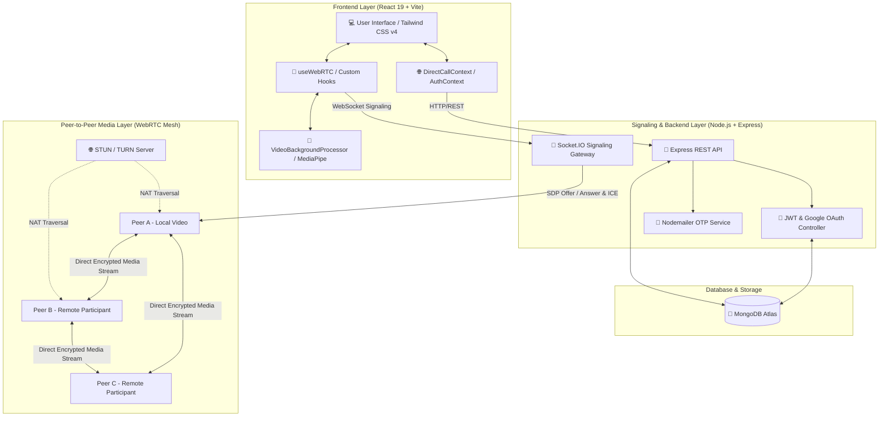
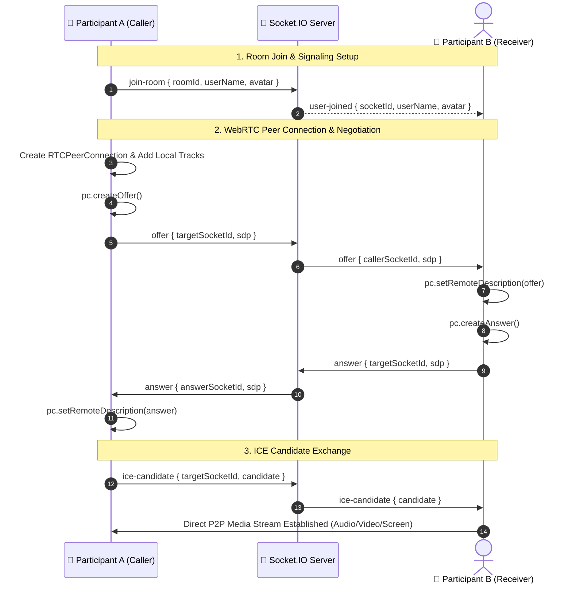

<p align="center">
  
</p>

<p align="center">
  
</p>

<p align="center">
  <a href="https://github.com/suvojitmanna/Live-classes/stargazers"></a>
  <a href="https://github.com/suvojitmanna/Live-classes/network/members"></a>
  <a href="https://github.com/suvojitmanna/Live-classes/issues"></a>
  <a href="https://github.com/suvojitmanna/Live-classes/blob/main/LICENSE"></a>
  <a href="https://github.com/suvojitmanna/Live-classes"></a>
  <a href="https://github.com/suvojitmanna/Live-classes"></a>
</p>

<p align="center">
  
  
  
  
  
  
  
  
  
  
</p>

---

## 📑 Table of Contents
- [🌟 Overview](#-overview)
- [✨ Key Features](#-key-features)
- [🎨 AI Virtual Backgrounds & Blur](#-ai-virtual-backgrounds--blur)
- [🏗️ System Architecture](#️-system-architecture)
- [🔄 WebRTC Signaling & Connection Flow](#-webrtc-signaling--connection-flow)
- [📂 Project Directory & File Structure](#-project-directory--file-structure)
- [⚙️ Environment Variables Configuration](#️-environment-variables-configuration)
- [🚀 Quickstart & Installation](#-quickstart--installation)
- [🔌 Socket.IO Event Reference](#-socketio-event-reference)
- [📡 REST API Endpoints](#-rest-api-endpoints)
- [📊 Repository Language & Code Metrics](#-repository-language--code-metrics)
- [🤝 Contributing](#-contributing)
- [📄 License & Author](#-license--author)

---

## 🌟 Overview

**Live Classes** is a full-stack, enterprise-grade video conferencing and virtual classroom web application built from the ground up with the **MERN Stack (MongoDB, Express, React 19, Node.js)**, **Native WebRTC**, and **Socket.IO**.

Unlike traditional video apps that depend on expensive third-party video SDKs (like Agora, Twilio, or LiveKit), **Live Classes utilizes pure browser-native WebRTC mesh connections**, giving you full ownership, zero per-minute licensing costs, and ultra-low latency peer-to-peer media transmission.

### 🎯 Ideal For:
- 🎓 **Universities & Schools**: Online lectures, tutoring sessions, and breakout groups.
- 💼 **Enterprises & Startups**: Daily team standups, sprint planning, and client meetings.
- 👨‍💻 **Technical Interviews**: Remote coding sessions, design reviews, and screensharing.
- 🌐 **1-on-1 Direct Calling**: Instant voice & video calls between registered users.

---

## ✨ Key Features

| Category | Features Included |
| :--- | :--- |
| 🎥 **Video & Audio** | Native WebRTC Peer-to-Peer HD Video, Ultra-low Latency Opus Audio, Active Speaker Glow Detection, Multi-device Hardware Switching (Mic/Camera/Speaker). |
| 🎨 **AI Backgrounds** | MediaPipe Selfie Segmentation, Slight Bokeh Blur, Heavy Privacy Blur, Clean Studio Color Backdrops, Green Screen Chroma, Photorealistic Virtual Rooms, Custom Device Uploads. |
| 🖥️ **Screen Sharing** | Full Display, Application Window, or Browser Tab Sharing with automatic track replacement across peers. |
| 🔍 **Display Controls** | Full Screen and Exit Full Screen with 1-click controls, Draggable Self-View Picture-in-Picture (PiP), Auto-adapting Responsive Video Grid. |
| 📞 **Direct 1-on-1 Calling** | Direct Call ringing modals, Answer/Decline triggers, In-call controls, Audio/Video toggles, Live Call Duration timer, and Call History logs. |
| 💬 **Collaboration** | Scoped Real-Time In-Meeting Chat, Unread Message Count Badges, Floating Animated Reaction Emojis, Interactive Live Polls with Real-Time Vote Tallies. |
| 🛡️ **Host Moderation** | Knocking / Waiting Room Admission Control, Global Mute All Participants, Force Stop Participant Cameras, Kick Participant, Meeting Link Expiration timers. |
| 🔐 **Authentication** | Google OAuth 2.0 Sign-In/Up, 6-Digit Email OTP Verification (Nodemailer SMTP), Password Reset via OTP, JWT Token Authorization with HTTP/Bearer headers. |
| 🌓 **Theme & UX** | Glassmorphism Frosted Dock, Dark & Light Mode Theme Support, Smooth Framer Motion Micro-interactions, Fully Mobile-Responsive Design. |

---

## 🎨 AI Virtual Backgrounds & Blur

Live Classes includes a client-side real-time video processing engine powered by **Google MediaPipe Selfie Segmentation**:

```
[Webcam Stream] ──► [Offscreen Canvas Processor] ──► [MediaPipe ML Segmentation]
                             │                                │
                             ├── Blur (10px - 24px)           ├── Foreground: User Face & Body
                             ├── Solid Color / Green Screen   └── Background: Rendered Layer
                             └── Virtual Room / Custom Image          │
                                                                      ▼
                                                       [canvas.captureStream(30)]
                                                                      │
                                                       [WebRTC replaceTrack()]
```

### 🖼️ Included Presets:
1. **Bokeh & Privacy Blur**:
   - `Slight Blur` (10px subtle depth-of-field effect)
   - `Heavy Blur` (24px complete background privacy)
2. **Remove Background & Studio Solids**:
   - `Studio Dark` (`#121316` clean modern backdrop)
   - `Executive Navy` (`#0f172a` professional dark blue)
   - `Pure White` (`#f8fafc` high-key portrait backdrop)
   - `Green Screen` (`#00ff00` chroma green for OBS/streaming)
3. **Photorealistic Virtual Rooms**:
   - 🏢 Modern Architectural Glass Office
   - 📚 Executive Wooden Bookshelf Library
   - 🛋️ Luxury Contemporary Apartment
   - ☕ Cozy Warm Coffee Shop & Cafe
   - 🏛️ University Grand Study Hall
4. **Sceneries & Aesthetic Workspaces**:
   - 🌅 Tropical Golden Sunset Beach
   - 🌲 Pine Mountain & Forest Mist
   - 🌆 Cyberpunk Neon Studio Workspace
   - 🎨 Minimalist 3D Pastel Abstract Studio
5. **Custom Upload**:
   - 📁 Upload any image from your computer (`.png`, `.jpg`, `.webp`) and apply it instantly!

---

## 🏗️ System Architecture



---

## 🔄 WebRTC Signaling & Connection Flow



---

## 📂 Project Directory & File Structure

```text
Live-classes/
├── 📁 client/                          # React Frontend Application (Vite + Tailwind CSS)
│   ├── 📁 src/
│   │   ├── 📁 component/               # Reusable UI Components
│   │   │   ├── 📁 common/              # Common UI Elements (Avatar, Modal, Tooltip)
│   │   │   ├── 📁 dashboard/           # Dashboard Widgets (ActionCard, SessionList, FeaturesGrid)
│   │   │   ├── 📁 directCall/          # 1-on-1 Direct Calling (DirectCallView, In/Outgoing Modals)
│   │   │   ├── 📁 Home/                # Landing Page Sections (Hero, Features, Benefits, CTA)
│   │   │   ├── 📁 meeting/             # Meeting Room Components
│   │   │   │   ├── ActivitiesPanel.jsx         # Whiteboard, polls, breakout activities
│   │   │   │   ├── ChatPanel.jsx               # In-meeting real-time chat with badges
│   │   │   │   ├── FloatingReactions.jsx       # Floating animated emoji reaction bubbles
│   │   │   │   ├── FloatingSelfView.jsx        # Draggable picture-in-picture local tile
│   │   │   │   ├── HostControlsPanel.jsx       # Host moderation controls (mute all, permissions)
│   │   │   │   ├── KeyboardShortcutsModal.jsx  # Hotkeys reference modal
│   │   │   │   ├── KnockNotificationModal.jsx  # Waiting room knock approval modal
│   │   │   │   ├── LeaveConfirmModal.jsx       # Leave / End meeting confirmation dialog
│   │   │   │   ├── MeetingCaptions.jsx         # Live voice captioning overlay
│   │   │   │   ├── MeetingControls.jsx         # Bottom frosted floating toolbar
│   │   │   │   ├── MeetingDetailsPanel.jsx     # Meeting info, joining link copy
│   │   │   │   ├── MeetingEndedView.jsx        # End meeting summary screen
│   │   │   │   ├── MeetingHeader.jsx           # Top header bar (clock, encryption, fullscreen)
│   │   │   │   ├── MeetingLobby.jsx            # Pre-join camera/mic check lobby
│   │   │   │   ├── MeetingSettings.jsx         # Hardware device selector (mic, cam, speaker)
│   │   │   │   ├── ParticipantPanel.jsx        # Participant roster & media statuses
│   │   │   │   ├── VideoGrid.jsx               # Dynamic auto-layout video grid
│   │   │   │   ├── VideoTile.jsx               # Individual video tile with speaking aura
│   │   │   │   └── VisualEffectsModal.jsx      # AI Virtual Backgrounds & Blur selection modal
│   │   │   ├── 📁 session/             # Session list & join components
│   │   │   ├── AuthForm.jsx            # Authentication form (Login / Signup / OTP)
│   │   │   ├── Header.jsx              # Application navbar
│   │   │   └── ProtectedRoute.jsx      # Route guard for authenticated pages
│   │   ├── 📁 context/                 # React Context State Providers
│   │   │   ├── AuthContext.jsx         # User auth, login, register, Google OAuth state
│   │   │   ├── DirectCallContext.jsx   # 1-on-1 direct call state & WebRTC manager
│   │   │   ├── SessionContext.jsx      # Meeting sessions context
│   │   │   └── ThemeContext.jsx        # Dark / Light theme provider
│   │   ├── 📁 hooks/                   # Custom React Hooks
│   │   │   ├── useAuth.js              # Auth helper hook
│   │   │   ├── useSession.js           # Session helper hook
│   │   │   └── useWebRTC.js            # Core group WebRTC & Socket.io engine
│   │   ├── 📁 pages/                   # Application Routed Pages
│   │   │   ├── Dashboard.jsx           # User dashboard (Start, Schedule, Join, Direct Call)
│   │   │   ├── Home.jsx                # Landing marketing page
│   │   │   ├── Login.jsx               # Login page
│   │   │   ├── MeetingRoom.jsx         # Interactive meeting room page
│   │   │   ├── NotFound.jsx            # 404 page
│   │   │   ├── Profile.jsx             # User profile & account settings
│   │   │   └── Register.jsx            # User registration page
│   │   ├── 📁 service/                 # API & WebSocket Client Services
│   │   │   ├── api.js                  # Axios instance with auth interceptor
│   │   │   └── socket.js               # Socket.io client singleton
│   │   ├── 📁 utils/                   # Utilities & Helpers
│   │   │   ├── constants.js            # API endpoints, ICE STUN/TURN servers
│   │   │   └── videoBackgroundProcessor.js # MediaPipe AI background blur/presets engine
│   │   ├── App.jsx                     # Root React application & route definitions
│   │   ├── main.jsx                    # Application entrypoint
│   │   └── index.css                   # Tailwind CSS v4 styling rules
│   ├── package.json                    # Frontend dependencies & scripts
│   └── vite.config.js                  # Vite configuration & React plugin
│
├── 📁 server/                          # Node.js + Express Backend Application
│   ├── 📁 config/
│   │   └── db.js                       # MongoDB connection setup
│   ├── 📁 controllers/                 # Route Controllers
│   │   ├── authController.js           # Auth, OTP generation, Google OAuth, password reset
│   │   ├── directCallController.js     # Direct call history & user check
│   │   ├── sessionController.js        # Meeting creation, verification, link expiration
│   │   └── userController.js           # User profile & avatar management
│   ├── 📁 middleware/                  # Express Middlewares
│   │   ├── authMiddleware.js           # JWT authentication protection
│   │   └── rateLimiter.js              # Request rate limiting for OTP & Auth endpoints
│   ├── 📁 models/                      # Mongoose Database Schemas
│   │   ├── DirectCall.js               # Direct call logs schema
│   │   ├── Session.js                  # Meeting room schema with settings & permissions
│   │   └── User.js                     # User account & credential schema
│   ├── 📁 routes/                      # REST API Routes
│   │   ├── authRoutes.js               # /api/auth endpoints
│   │   ├── directCallRoutes.js         # /api/direct-call endpoints
│   │   ├── sessionRoutes.js            # /api/session endpoints
│   │   └── userRoutes.js               # /api/user endpoints
│   ├── 📁 socket/                      # Real-Time WebSocket Handlers
│   │   ├── directCallSocket.js         # 1-on-1 call signaling & presence
│   │   └── meetingSocket.js            # Room signaling, chat, polls, reactions, moderation
│   ├── 📁 utils/                       # Server Utilities
│   │   ├── emailService.js             # Nodemailer SMTP mailer with HTML OTP templates
│   │   └── generateToken.js            # JWT signing helper
│   ├── index.js                        # Express server entry point & Socket.IO server initialization
│   └── package.json                    # Backend dependencies & scripts
│
└── README.md                           # Comprehensive documentation
```

---

## ⚙️ Environment Variables Configuration

To run Live Classes locally or in production, configure environment files for both the `server` and `client`.

### 1. Server Configuration (`server/.env`)

Create a `.env` file in the `server/` directory:

```env
# SERVER CONFIGURATION
PORT=5000
NODE_ENV=development
CLIENT_URL=http://localhost:5173

# DATABASE (MongoDB Atlas / Local)
MONGO_URI=mongodb+srv://<username>:<password>@cluster.mongodb.net/live-classes?retryWrites=true&w=majority

# JWT AUTHENTICATION
JWT_SECRET=your_super_secret_jwt_encryption_key_min_32_characters
JWT_EXPIRES_IN=7d

# GOOGLE OAUTH 2.0 CREDENTIALS
# (Obtain from Google Cloud Console -> APIs & Credentials)
GOOGLE_CLIENT_ID=your_google_oauth_client_id.apps.googleusercontent.com
GOOGLE_CLIENT_SECRET=your_google_oauth_client_secret

# SMTP EMAIL SERVICE (For 6-Digit Email OTP)
# (e.g. Gmail App Password, SendGrid, or Mailtrap)
SMTP_HOST=smtp.gmail.com
SMTP_PORT=587
SMTP_USER=your_email_address@gmail.com
SMTP_PASSWORD=your_16_character_app_password
EMAIL_FROM="Live Classes Team" <noreply@liveclasses.c

# WEBRTC STUN / TURN CONFIGURATION
STUN_SERVER_URL=stun:stun.l.google.com:19302
```

### 2. Client Configuration (`client/.env`)

Create a `.env` file in the `client/` directory:

```env
# API & WEBSOCKET BACKEND URLS
VITE_BASE_URL=http://localhost:5000/api
VITE_SOCKET_URL=http://localhost:5000

# GOOGLE OAUTH CLIENT ID (Must match backend)
VITE_GOOGLE_CLIENT_ID=your_google_oauth_client_id.apps.googleusercontent.com

# STUN SERVER FOR WEBRTC NAT TRAVERSAL
VITE_STUN_SERVER_URL=stun:stun.l.google.com:19302
```

---

## 🚀 Quickstart & Installation

Follow these steps to run the complete stack locally on your machine:

### 📋 Prerequisites
- **Node.js**: `v18.0.0` or higher ([Download](https://nodejs.org/))
- **npm**: `v9.0.0` or higher
- **MongoDB**: Local MongoDB server or free [MongoDB Atlas](https://www.mongodb.com/atlas) cluster
- **Git**: Installed on your system

---

### Step 1: Clone Repository
```bash
git clone https://github.com/suvojitmanna/Live-classes.git
cd Live-classes
```

---

### Step 2: Install & Start Backend Server
```bash
# Navigate to server directory
cd server

# Install dependencies
npm install

# Start development server with live reload
npm run dev
```
> The backend server will start on `http://localhost:5000`.

---

### Step 3: Install & Start Frontend Client
Open a **new terminal tab/window**:

```bash
# Navigate to client directory
cd client

# Install dependencies
npm install

# Start Vite development server
npm run dev
```
> The frontend client will start on `http://localhost:5173`. Open your browser and navigate to `http://localhost:5173`!

---

### Step 4: Build for Production

#### Build Client:
```bash
cd client
npm run build
```
This generates an optimized static bundle in `client/dist/`.

#### Start Production Server:
```bash
cd server
NODE_ENV=production npm start
```

---

## 🔌 Socket.IO Event Reference

### 👥 Group Meeting Signaling Events:

| Event Name | Direction | Payload | Description |
| :--- | :---: | :--- | :--- |
| `join-room` | Client ➔ Server | `{ roomId, userName, avatar }` | Join meeting room roster |
| `user-joined` | Server ➔ Client | `{ socketId, userName, avatar }` | Emitted when a peer enters room |
| `offer` | Client ➔ Server ➔ Client | `{ targetSocketId, callerSocketId, sdp }` | WebRTC SDP offer negotiation |
| `answer` | Client ➔ Server ➔ Client | `{ targetSocketId, answerSocketId, sdp }` | WebRTC SDP answer response |
| `ice-candidate` | Client ➔ Server ➔ Client | `{ targetSocketId, candidate }` | WebRTC ICE candidate exchange |
| `toggle-audio` | Client ➔ Server ➔ Room | `{ roomId, isMuted }` | Sync audio mute state |
| `toggle-video` | Client ➔ Server ➔ Room | `{ roomId, isVideoOff }` | Sync camera enable/disable state |
| `screen-share` | Client ➔ Server ➔ Room | `{ roomId, isScreenSharing }` | Sync screen presentation state |
| `raise-hand` | Client ➔ Server ➔ Room | `{ roomId, isHandRaised }` | Toggle hand raise notification |
| `send-reaction` | Client ➔ Server ➔ Room | `{ roomId, emoji }` | Broadcast floating reaction emoji |
| `send-chat-message`| Client ➔ Server ➔ Room | `{ roomId, text, sender }` | Broadcast in-meeting text chat |
| `create-poll` | Host ➔ Server ➔ Room | `{ roomId, question, options }` | Create real-time meeting poll |
| `vote-poll` | Client ➔ Server ➔ Room | `{ roomId, pollId, optionIndex }`| Cast a vote in live poll |
| `knock-room` | Client ➔ Server ➔ Host | `{ roomId, userName, avatar }` | Request entry to locked meeting |
| `admit-user` | Host ➔ Server ➔ Client | `{ roomId, targetSocketId }` | Approve waiting room participant |
| `force-mute` | Host ➔ Server ➔ Client | `{ targetSocketId }` | Host mutes participant |
| `force-kick` | Host ➔ Server ➔ Client | `{ targetSocketId }` | Host removes participant from room |
| `user-left` | Server ➔ Room | `{ socketId, userName }` | Emitted when a peer disconnects |

### 📞 1-on-1 Direct Calling Events:

| Event Name | Direction | Payload | Description |
| :--- | :---: | :--- | :--- |
| `direct-call:register` | Client ➔ Server | `{ userId }` | Associate socket with user ID |
| `direct-call:initiate` | Caller ➔ Server ➔ Callee | `{ targetEmail, callType }` | Ring target user |
| `direct-call:accept` | Callee ➔ Server ➔ Caller | `{ callId }` | Accept incoming direct call |
| `direct-call:decline` | Callee ➔ Server ➔ Caller | `{ callId }` | Decline incoming direct call |
| `direct-call:offer` | Caller ➔ Server ➔ Callee | `{ callId, targetSocketId, sdp }` | Direct WebRTC SDP offer |
| `direct-call:answer` | Callee ➔ Server ➔ Caller | `{ callId, targetSocketId, sdp }` | Direct WebRTC SDP answer |
| `direct-call:end` | Peer ➔ Server ➔ Peer | `{ callId, targetSocketId }` | Terminate direct call session |

---

## 📡 REST API Endpoints

### 🔐 Authentication (`/api/auth`)
- `POST /api/auth/register` - Create new account & send 6-digit email OTP.
- `POST /api/auth/verify-otp` - Verify OTP and activate account.
- `POST /api/auth/resend-otp` - Resend a new 6-digit email OTP.
- `POST /api/auth/login` - Authenticate user & issue JWT token.
- `POST /api/auth/google` - Sign-in or register with Google OAuth token.
- `POST /api/auth/forgot-password` - Request password reset OTP email.
- `POST /api/auth/reset-password` - Reset account password with OTP.
- `GET /api/auth/profile` - Fetch authenticated user profile (`Bearer <JWT>`).

### 🎥 Sessions & Meetings (`/api/session`)
- `POST /api/session/create` - Create a new meeting with custom room ID & permissions.
- `GET /api/session/:roomId` - Verify meeting existence, host details, and expiration.
- `POST /api/session/update-settings` - Update room permissions (Chat, Mic, Camera, Screen).
- `GET /api/session/user/sessions` - Retrieve logged-in user's meeting history.

### 📞 Direct Calls (`/api/direct-call`)
- `POST /api/direct-call/check-user` - Verify if target email is registered and online.
- `GET /api/direct-call/history` - Retrieve 1-on-1 call history logs.
- `DELETE /api/direct-call/history/:id` - Delete specific call history record.

---

## 📊 Repository Language & Code Metrics

<p align="center">
  
</p>

---

## 🤝 Contributing

Contributions are warmly welcomed! To contribute to Live Classes:

1. **Fork the Repository** on GitHub.
2. **Create a Feature Branch**:
   ```bash
   git checkout -b feature/amazing-feature
   ```
3. **Commit your Changes**:
   ```bash
   git commit -m "Add amazing feature"
   ```
4. **Push to Branch**:
   ```bash
   git push origin feature/amazing-feature
   ```
5. **Open a Pull Request** describing your changes.

---

---

<div align="center">

### 📄 License & Author

Distributed under the **ISC License**. See [`LICENSE`](LICENSE) for more information.

<br/>

**Developed with ❤️ by [Suvojit Manna](https://github.com/suvojitmanna)**

<br/>

<a href="https://github.com/suvojitmanna">
  
</a>
&nbsp;
<a href="mailto:mannasuvojit34@gmail.com">
  
</a>

<br/><br/>

⭐ **If you found this project helpful, please give it a star on GitHub!** ⭐

</div>


