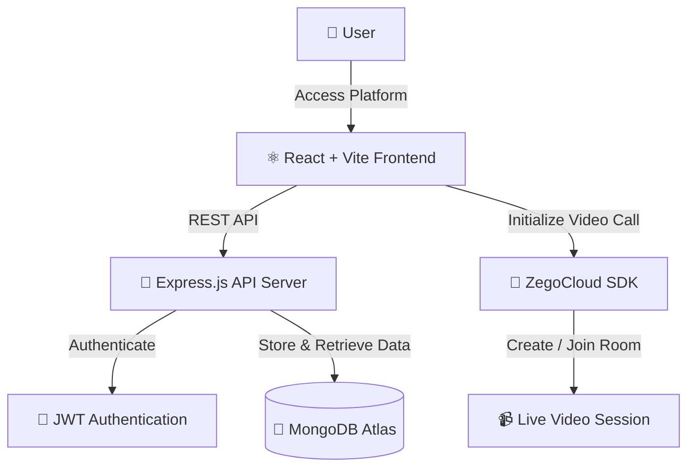

---

## 🏆 Project Badges

---

## 🌍 Live Demo

🚀 **Live Application**

👉 https://live-classes.vercel.app

💻 **GitHub Repository**

👉 https://github.com/suvojitmanna/Live-classes

---

## 🧱 Built With

---

## 📊 Repository Stats

---
# 📖 Overview

## 🌟 What is Live Classes?

**Live Classes** is a production-ready **Full Stack Video Conferencing Platform** built using the **MERN Stack** and **ZegoCloud**.

It enables users to create, join, and manage live video meetings with a fast, responsive, and modern user experience.

The project follows a scalable SaaS architecture with secure authentication, REST APIs, cloud database integration, and real-time communication.

It is suitable for:

- 🎓 Online Classes
- 💼 Team Meetings
- 👨‍🏫 Virtual Training
- 🎤 Webinars
- 💻 Coding Interviews

---

# 🎯 Why This Project?

Unlike basic video call demos, **Live Classes** demonstrates production-level development practices.

### Highlights

- ✅ Full Stack MERN Architecture
- ✅ Real-Time Video Streaming
- ✅ Secure Authentication
- ✅ REST API Design
- ✅ MongoDB Database
- ✅ Cloud Deployment
- ✅ Responsive UI
- ✅ Scalable Folder Structure

---

# ✨ Features

## 🎥 Real-Time Video

- 📹 HD Video Meetings
- 🎙 Crystal Clear Audio
- 👥 Multi-Participant Support
- ⚡ Low Latency Streaming
- 🔄 Automatic Reconnection
- 🎥 Powered by ZegoCloud SDK

---

## 🔐 Authentication

- 🔑 JWT Authentication
- 📧 Email Login
- 👤 User Profile
- 🚪 Secure Logout
- 🔒 Protected Routes

---

## 🧑‍🏫 Meeting Management

- ➕ Create Meeting
- 🚪 Join Meeting
- ❌ Delete Meeting
- 📋 Meeting History
- 🟢 Active Status
- 🔴 Ended Status

---

## 🔗 Smart Sharing

- 📋 Copy Meeting Link
- 🌍 Share with Anyone
- ⚡ One-Click Join
- 🔗 Invite Participants

---

## 🎨 Modern UI

- 📱 Fully Responsive
- 🌙 Beautiful Interface
- ✨ Smooth Animations
- ⚡ Fast Navigation
- 🎯 Clean Dashboard
- 💎 Premium User Experience

---

# 📸 Screenshots

## 🏠 Home Page

---

## 📱 Mobile Responsive

---

# 🏗️ System Architecture
         +----------------------------+
                    |        Web Browser         |
                    +-------------+--------------+
                                  |
                     React + Vite + Tailwind CSS
                                  |
                           Axios REST API
                                  |
                +-----------------+-----------------+
                |                                   |
         Express.js Backend                JWT Authentication
                |                                   |
         Business Logic Layer              Protected Routes
                |
          MongoDB Database
                |
        ZegoCloud Video Engine
                |
      Real-Time Audio & Video Streaming

---

---

# 📊 Architecture Diagram

---

# ⭐ Project Highlights

<table>
<tr>
<td width="50%">

### 🚀 Performance

- ⚡ Fast Vite Development
- 🚀 Optimized REST APIs
- ☁️ Cloud Ready Deployment
- 📱 Mobile Responsive

</td>

<td width="50%">

### 🎥 Core Features

- 🎥 HD Live Video Classes
- 🔒 Secure JWT Authentication
- 🧑‍🏫 Create & Join Meetings
- 🔗 Instant Meeting Sharing

</td>
</tr>

<tr>
<td>

### 💻 Tech Stack

- ⚛️ React.js + Vite
- 🚀 Node.js + Express
- 🍃 MongoDB
- 🎥 ZegoCloud SDK

</td>

<td>

### 🎨 User Experience

- ✨ Modern SaaS UI
- 🌙 Clean Dashboard
- 🎭 Smooth Animations
- 📈 Scalable Architecture

</td>
</tr>
</table>

---

# 📈 Project Statistics

| Category | Details |
|-----------|---------|
| 🏗️ Architecture | MERN Stack |
| 🎥 Video Engine | ZegoCloud |
| 🔐 Authentication | JWT |
| 🗄️ Database | MongoDB |
| 📱 Responsive | ✅ Yes |
| ☁️ Deployment | Vercel |
| 🚀 Production Ready | ✅ Yes |

---

# 👀 Repository Visitors

---

### ⭐ If you found this project useful, consider giving it a Star!

Made with ❤️ by **Suvojit Manna**

---
